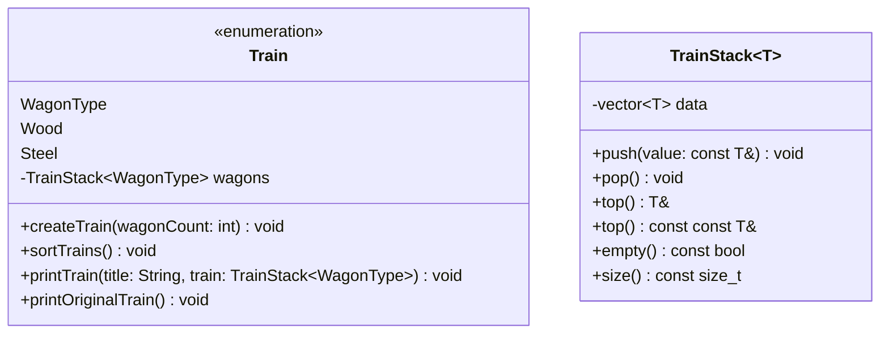

Диаграмма классов (3 пункт задания)

```mermaid
classDiagram
    class Train {
        <<enumeration>>
        WagonType
        Wood
        Steel
        
        -TrainStack~WagonType~ wagons
        +createTrain(wagonCount: int) void
        +sortTrains() void
        +printTrain(title: String, train: TrainStack~WagonType~) void
        +printOriginalTrain() void
    }

    class TrainStack~T~ {
        -vector~T~ data
        +push(value: const T&) void
        +pop() void
        +top() T&
        +top() const const T&
        +empty() const bool
        +size() const size_t
    }
```
